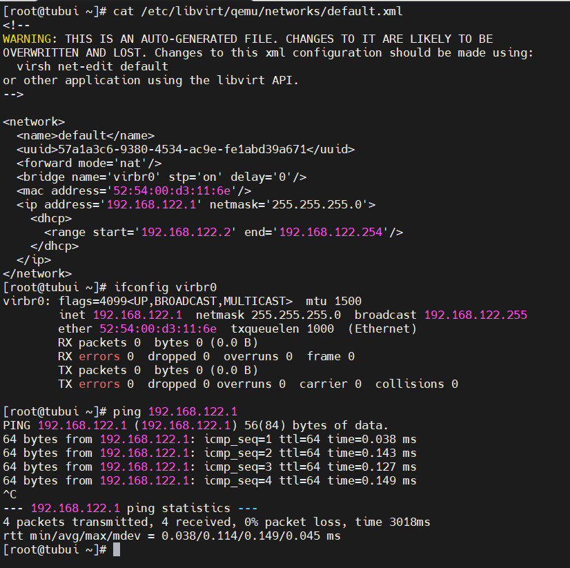
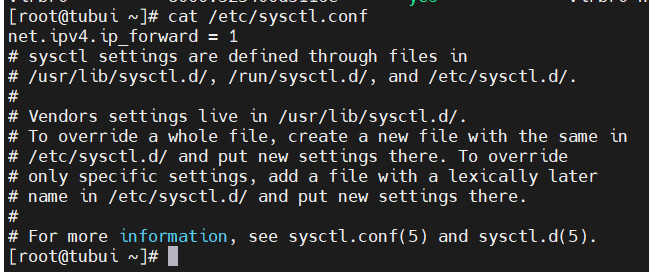

# Linux Virtual Networking
- Linux Virtual Networking có thể dễ dàng tạo ra từ `libvirt` và `linux virtual bridge`
- Cài đặt và bắt đầu kích hoạt `libvirt`:
```sh
yum install libvirt
systemctl start libvirtd
systemctl enable libvirtd
```
- `libvirt` hỗ trợ các loại mạng ảo sau
	+ Network Address Translation mode (Chế độ dịch địa chỉ mạng - NAT)
	+ Routed Mode (Chế độ định tuyến)
	+ Isolated Mode (Chế độ cô lập)
	+ Bridged Mode (Chế độ bridged)

## Virtual Networking trong NAT mode
- Khi trình nền `libvirt` được cài đặt trên máy chủ, nó đi kèm với cấu hình chuyển đổi mạng ảo, switch ảo mặc định ở chế độ NAT và được sử dụng bởi các máy ảo để liên lạc với mạng bên ngoài thông qua máy chủ vật lí
- File cấu hình được lưu tại `/etc/libvirt/qemu/networks/default.xml`
- Interface virbr0 cũng được tạo trên máy chủ



- Lệnh `virsh` dùng để kiểm tra và cấu hình mạng ảo
```sh
virsh net-list.
```


- Khi `libvirt` đang chạy mặc định, ta sẽ thấy 1 bridge bị cô lập. Bridge này không có bất kỳ interface vật lý nào thêm vào, vì nó sử dụng NAT để kết nối mạng ra ngoài


- `libvirt` sẽ thêm quy tắc `iptable`. Nó cũng sẽ kích hoạt `ip-forward`


