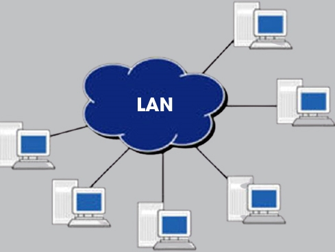
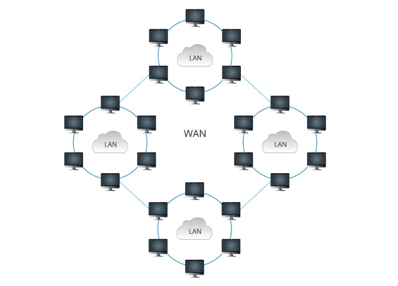
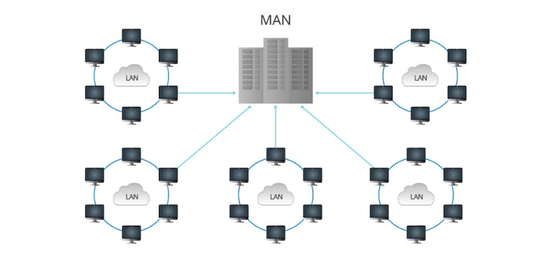
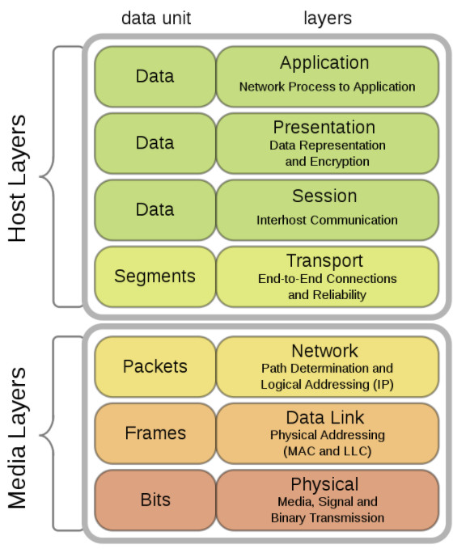
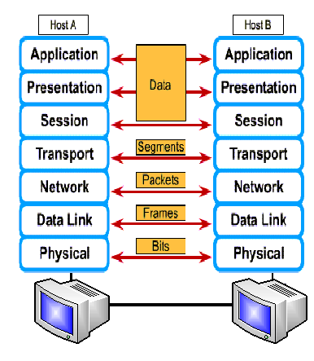
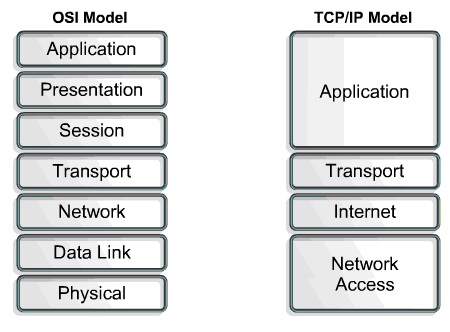

# 1.1 Mạng truyền thông và công nghệ mạng
## 1.1.1 Giới thiệu chung
Truyền thông mạng máy tính (computer communications) là quá trình truyền dữ liệu từ thiết bị này sang thiết bị khác.

Khái niệm mạng (networking): Chỉ khái niệm kết nối các thiết bị lại với nhau nhằm mục đích chia sẻ thông tin, khái niệm mạng liên quan đến nhiều vấn đề bao gồm:
- Giao thức truyền thông (protocol): Mô tả những nguyên tắc mà tất cả các thành phần mạng cần tuân thủ để có thể trao đổi được với nhau
- Topo (mô hình ghép nối mạng/hình trạng mạng): Mô tả cách thức kết nối các thiết bị với nhau
- Địa chỉ: Mô tả cách thức định vị một đối tượng trên mạng
- Định tuyến (routing): Mô tả cách thức dữ liệu truyền từ thiết bị này sang thiết bị khác
- Tính tin cậy (reliability): Giải quyết tính toàn vẹn của dữ liệu, đảm bảo dữ liệu nhận được chính xác như dữ liệu đã gửi đi
- Khả năng tương tác (interoperability): Chỉ mức độ tương tác giữa các sản phẩm phần mềm và phần cứng của các hãng sản xuất khác nhau có thể làm việc cùng nhau
- An ninh (security): Đảm bảo an toàn hoặc bảo vệ tất cả các thành phần của mạng
- Chuẩn (standard): Thiết lập các quy tắc và luật lệ cụ thể cần phải tuân theo

Khái niệm mạng xuất hiện ở nhiều kiểu ứng dụng khác nhau như trong công nghiệp giải trí, truyền hình... 

Mạng truyền thông ra đời sớm nhất và phổ biến nhất là mạng điện thoại. Hai loại hệ thống mạng điện thoại phổ biến: 
- Hệ thống mạng điện thoại kiểu cũ (POTS - Pain old telephone system)
- Mạng điện thoại chuyển mạch công cộng (PSTN - public switched telephone network): Mô tả hệ thống điện thoại truyền thông dựa trên tín hiệu tương tự được sử dụng để truyền tiếng nói

Ngoài mạng điện thoại ra còn có mạng Internet - một mạng truyền thông quen thuộc và phổ biến ...

## 1.1.2 Mạng máy tính
Mạng bao gồm nhiều thành phần, các thành phần được nối với nhau theo một cách thức nào đó và cùng sử dụng chung một ngôn ngữ:
- Các thiết bị đầu cuối (End system): Kết nối với nhau tạo thành mạng, có thể là máy tính, điện thoại, tivi hoặc các thiết bị khác
- Môi trường truyền (Media): Thực hiện việc truyền dẫn các tín hiệu vật lý. Môi trường truyền có thể là các loại dây dẫn (cáp), sóng (đối với các mạng không dây)
- Giao thức (Protocol): Là quy tắc định cách trao đổi dữ liệu giữa các thực thể

Ba khái niệm trên đưa đến một định nghĩa chuẩn về mạng máy tính như sau: Mạng máy tính là tập hợp các máy tính và các thiết bị phụ trợ khác sử dụng trung một nhóm giao thức để chia sẻ tài nguyên thông qua các phương tiên truyền thông mạng

### Các thành phần mạng: thiết bị, nút, máy tính
Thiết bị (device): Chỉ bất cứ một thực thể phần cứng nào chẳng hạn các thiết bị đầu cuối, máy in, máy tính, hoặc một thiết bị phần cứng liên quan đến mạng, ví dụ máy chủ(server), repeater(bộ lặp), bridge(cầu), switch(bộ chuyển mạch), router(Bộ định tuyến)...

Có nhiều phương pháp gán cho thiết bị mạng một định danh duy nhất, thường thì thiết bị được chính hãng sản xuất sẽ gắn một số nhận dạng duy nhất, việc này tương tự như việc in số seri trên tivi hoặc các đồ dùng điện tử

Khi mô tả các thành phần mạng, cần phân biệt giữa khái niệm thiết bị (device) và máy tính (computer)

### Phương tiện và các giao thức truyền thông mạng 
Để chia sẻ và sử dụng dịch vụ trên mạng, các thành phần của mạng phải có khả năng truyền thông được với nhau. Để đáp ứng được yêu cầu này, ta cần xét tới hai tiêu chí cụ thể của mạng:

- Khả năng liên kết (connectivity): Chỉ đường truyền hoặc kết nối vật lý giữa các thành phần

- Ngôn ngữ (language): Chỉ một bảng từ vựng cùng các quy tắc truyền thông mà các thành phần phải tuân thủ.

### Môi trường truyền thông
Môi trường vật lý sử dụng kết nối các thành phần của mạng thường được gọi là môi trường truyền thông (medium, media). Môi trường truyền thông mạng được chia thành hai loại: cáp (cable) và không dây (wirelesss). Ví dụ, cáp truyền thông có thể là cáp xoắn đôi(twisted-pair), cáp đồng trục (coaxial) và cáp sợi quang (fiber-optic cable)... Truyền thông không dây có thể là sóng radio ...

Giao thức (protocol): Ngôn ngữ được sử dụng bởi các thực thể mạng gọi là giao thức truyền thông mạng. Các bên truyền thông có thể giao tiếp được với nhau do giao thức định nghĩa một ngôn ngữ chung giữa các thành phần mạng. Ta có thể hiểu giao thức truyền thông mạng là một tập hợp các quy tắc chuẩn cho phép hai hoặc nhiều thực thể trong một hệ thống thông tin liên lạc để trao đổi thông tin

Ví dụ: TCP/IP là một giao thức mạng quen thuộc - một trong những giao thức của bộ giao thức TCP/IP (Transmission Control Protocol/Internet Protocol) TCP/IP được gọi là xương sống của Internet. Tuy tên TCP/IP nhưng thường sử dụng để chỉ nhóm gồm nhiều giao thức ngoài TCP và IP. Tập hợp các giao thức này được gọi là bộ giao thức TCP/IP, có thể kể đến một số giao thức trong bộ giao thức TCP/IP như FTP (File Transfer Protocol), HTTP (HyperText Transfer Protocol), POP (Post Office Protocol), SMTP (Simple Mail Transfer Protocol)...

## 1.1.3 Phân loại mạng máy tính
Có rất nhiều kiểu mạng máy tính khác nhau. Việc phân loại chúng thường dựa trên các đặc điểm chung
### Phân loại mạng theo diện hoạt động
Mạng cục bộ (Local Area Network - LAN): Liên kết các tài nguyên máy tính trong một vùng có kích thước han chế (có thể là một phòng hay vài phòng trong một tòa nhà). IEEE (Institute of Electrical and Electronícs Engineers) đưa ra tiêu chuẩn bán kính của mạng LAN nhỏ hơn 10km. Ví dụ về một số công nghệ mạng LAN: Ethernet/802.3, Token Ring, mạng FDDI (Fiber Distributed Data Interface)
- Một mạng LAN đơn giản

Mạng diện rộng (Wide Area Network - WAN): Liên kết tài nguyên máy tính trong một vùng địa lý rộng (có bán kính trên 100km) như thị xã, thành phố, tỉnh, quốc gia. Có thể coi mạng WAN gồm nhiều mạng LAN khác nhau. Ví dụ một số công nghệ mạng WAN: ISDN (Intergrated Service Data Network), frame relay, SMDS (Switched Multimegabit Data Service) và ATM (Asynchronous Transfer Mode)
- Mạng WAN - kết hợp của nhiều mạng LAN trong một vùng địa lý rộng

Mạng đô thị (Metropolitan Area Network - MAN): Liên kết các tài nguyên máy tính trong một thành phố. Mạng MAN được dùng để chỉ các mạng có diện hoạt động lớn hơn LAN nhưng nhỏ hơn WAN
- Mạng MAN - kết hợp của nhiều mạng LAN trong một vùng địa lý

Mạng cá nhân (Personal Area Network - PAN): Mạng máy tính nhỏ sử dụng trong gia đình

Mạng toàn cầu (Global Area network - GAN): Mạng của các mạng WAN, trải rộng trên phạm vi toàn cầu. Ví dụ nhiều công ty hoạt động trên nhiều nước trên thế giới. Việc kết nối mạng của các công ty còn lại với nhau tạo thành mạng GAN

### Phân loại theo mô hình ghép nối
Một cách khác để phân loại mạng là theo topo - mô hình ghép nối mạng hay còn gọi là hình trạng mạng. Topo mạng gần giống như bản đồ, nó mô tả chi tiết cách thức kết nối các thành phần chính của mạng (các nút) và các đường truyền. Có 3 loại mô hình tổng quát: điểm - điểm (point-to-point) broadcast (điểm-nhiều điểm) và multidrop (đa chặng)

- Mô hình điểm - điểm (point-to-point): Mạng point-to-point gồm nhiều nút, mỗi nút chỉ có thể liên lạc với nút liền kề qua đường liên kết trực tiếp. Nếu một nút cần liên lạc với nút không liền kề, nó buộc phải liên lạc gián tiếp thông qua chuỗi các nút khác. Đầu tiên, nút nguồn chuyển thông điệp tới nút liền kề với mình, sau đó thông điệp này sẽ được chuyển tuần tự qua các dãy nút liền kề nhau cho đến khi đến được nút đích. Việc chuyển dữ liệu thông qua nút liền kề đến một nút khác được gọi là bridging hoặc routing (định tuyến)
- Mô hình sao (Star): Đặc điểm chính của mạng hình sao là có một hub xử lý trung tâm, hub này là trung tâm truyền tin cho tất cả các nút. Để các nút có thể truyền thông cho nhau, tất cả dữ liệu phải được chuyển qua hub. Nếu hub ngừng hoạt động thì toàn bộ mạng sụp đổ
- Mô hình cây (Tree): Mô hình cây là mô hình phân cấp, gồm một nút gốc hoặc một hub nối đến các nút hoạt động ở lớp 2 hoặc đến hub lớp 2, các thiết bị ở lớp 2 lại được nối đến các thiết bị ở lớp 3 ...
- Mô hình điểm - nhiều điểm: Trong mô hình này dữ liệu từ một máy gửi đi sẽ được truyền đến tất cả các nút tham gia kênh truyền dùng chung. Các máy sẽ kiểm tra xem liệu chúng có phải là đích đến của thông điệp nhận được hay không bằng cách kiểm tra địa chỉ đến (destination address) của thông điệp
- Mô hình Bus : Topo dạng bus thuộc mô hình điểm - nhiều điểm, các nút mạng được nối đến cùng một kênh truyền
- Mô hình vòng (Ring): Tất cả các nút được nối thành một vòng. Thông điệp được truyền lần lượt qua các nút trên vòng

### Phân loại mạng theo kiểu chuyển
Ngoài việc phân loại theo diện hoạt động và topo, mạng còn được phân loại theo cách dữ liệu mà chúng truyền đi. Hai phân loại điển hình là: 
- Mạng chuyển mạch ảo (Virtual circuit-switched): Phải thiết lập mạch vật lý giữa nguồn và đích trước khi chuyển dữ liệu thực sự. Mạch này tồn tại trong suốt thời gian chuyển dữ liệu
- Mạng chuyển gói (Packet-switched): Thông điệp được chia thành những đơn vị nhỏ hơn là packet, những packet lần lượt được gửi tới nút nhận qua mạng lưới các thiết bị chuyển mạch trung gian (switch). Khi packet đến thiết bị trung gian, thiết bị này căn cứ vào địa chỉ của packet để quyết định xem sẽ chuyển packet đi theo hướng nào để đến được thiết bị kế tiếp

## 1.1.4 Địa chỉ mạng, định tuyến, tính tin cậy, tính liên lạc và an ninh mạng 
Khái niệm mạng máy tính liên quan đến nhiều yếu tố, trong đó có địa chỉ, định tuyến, tính tin cậy, tính liên lạc và an ninh mạng 
- Địa chỉ (Address): Khái niệm địa chỉ liên quan đến việc gán cho mỗi nút mạng một địa chỉ duy nhất, cho phép các thiết bị khác định vị được nó. 
- Định tuyến (Định tuyến): Định tuyến xác định tuyến đường mà dữ liệu sẽ đi qua trong quá trình truyền từ nút nhận đến nút gửi. Chức năng định tuyến được thực hiện bởi một thiết bị phần cứng đặc biệt: router (Thiết bị định tuyến). Việc lựa chọn tuyến đường tốt nhất phải dựa trên một tiêu chuẩn cụ thể được gọi là độ đo (metric). Các độ đo định tuyến phổ biến là: khoảng cách, số chặng (hop) và băng thông
- Tính tin cậy: Chỉ tính toàn vẹn dữ liệu - đảm bảo dữ liệu nhận được giống hệt dữ liệu gửi đi. Nếu qua trình nhận phát hiện ra lỗi, phía nhận có thể yêu cầu truyền lại dữ liệu bị lỗi hoặc kiểm tra dữ liệu đúng là gì và sửa lại nếu bị lỗi (Cách thứ nhất là sửa lỗi bằng cách yêu cầu truyền lại, cách thứ hai là tự sửa lỗi). Có hai cách để phát hiện lỗi thông dụng là kiểm tra bit chẵn/lẻ và mã dư thừa (CRC - Cyclic Redundancy Check)
- Tính liên tác (Interoperability): Chỉ khả năng các sản phẩm (phần cứng hoặc phần mềm) của các hãng sản xuất khác nhau có thể giao tiếp được với nhau trong mạng
- An ninh: An ninh mạng chỉ việc bảo vệ mọi thứ trong mạng, bao gồm dữ liệu truyền thông và các thiết bị. An ninh mạng cũng bao gồm việc định ra những chính sách sử dụng tài nguyên mạng, kiểm tra xem tài nguyên mạng có được sử dụng phù hợp với chính sách đã định trước hay không, quy định và kiểm tra chỉ những người có đủ quyền mới được sử dụng các tài nguyên đó...

## 1.1.5 Chuẩn mạng 
Chuẩn mạng định nghĩa các giao tiếp phần cứng, giao tiếp truyền thông, kiến trúc mạng... Chuẩn mạng thiết lập những quy tắc hay các quy ước cụ thể mà các bên tham gia truyền thông cần tuân thủ 
- Chuẩn chính thức (De jure standard)
- Chuẩn thực tế (De facto standard)
- Chuẩn riêng của hãng
- Chuẩn hiệp hội

# 1.2 Mô hình OSI
Mô hình OSI (Open Systems Interconnection - Mô hình liên kết giữa các hệ thống mở) là mô hình cho phép bất cứ hai hệ thống nào (cho dù khác nhau) có thể truyền thông với nhau mà không cần quan tâm đến kiến trúc bên dưới của chúng

Mô hình OSI ra đời với mục đích cho phép hai hệ thống bất kỳ truyền thông với nhau mà không cần thay đổi bất cứ phần cứng hoặc phần mềm nào. 

Mô hình OSI không phải là một giao thức, nó là một mô hình để nhận biết và thiết kế một kiến trúc mạng linh động, vững chắc và có khả năng liên tác

## 1.2.1 Mô hình
Mô hình OSI được phân thành 7 tầng riêng biệt nhưng nó liên quan đến nhau, mỗi tầng định nghĩa một phần của quá trình truyền thông tin trên mạng 

Kiến trúc phân tầng: Mô hình OSI gồm 7 tầng
- Tầng vật lý (Physical layer)
- Tầng liên kết dữ liệu (Datalink layer)
- Tầng mạng (Network layer)
- Tầng giao vận (Transport layer)
- Tầng phiên (Session layer)
- Tầng trình diễn (Presentation layer)
- Tầng ứng dụng (Application layer)

- Mô hình OSI

## 1.2.2 Chức năng của các tầng
- Tầng vật lý (Physical layer): Thực hiện các chức năng cần thiết để truyền luồng bit dữ liệu đi qua môi trường vật lý
- Tầng liên kết dữ liệu (Datalink layer): Tầng liên kết dữ liệu chịu trách nhiệm đóng gói dữ liệu (Framing), định địa chỉ vật lý, kiểm soát lưu lượng, kiểm soát lỗi và kiểm soát truy cập
- Tầng mạng (Network layer): Chuyển gói dữ liệu từ nơi gửi đến nơi nhận, chức năng chính của tầng này là định tuyến đường đi cho gói tin chứa dữ liệu
- Tầng giao vận (Transport layer): Đáp ứng tạm thời 1 phiên truyền thông giữa phía nguồn và đích. Tầng này sử dụng hai giao thức để thực hiện là TCP và UDP
- Tầng phiên (Session layer): Tạo và duy trì 1 phiên kết nói giữa nguồn và đích, xử lí việc trao đổi thông tin, khởi tạo kết nối, duy trì kết nối và kết thúc 1 phiên kết nối
- Tầng trình diễn (Presentation layer): Mã hóa, nén dữ liệu và chuyển đổi dữ liệu từ lớp ứng dụng
- Tầng ứng dụng (Application layer): Cung cấp các giao diện trực tiếp với người dùng, cung cấp ứng dụng giúp người dùng trao đổi trực tiếp qua mạng

## 1.2.3 Quy trình truyền dữ liệu trong OSI
Khi đi từ thiết bị A đến thiết bị B

**Phía máy gửi**
- Tại tầng 7 (Tầng ứng dụng): Người dùng tiến hành đưa thông tin cần gửi vào máy tính. Các thông tin cần gửi này có dạng như: hình ảnh, văn bản... Sau đó thông tin dữ liệu được chuyển xuống tầng trình diễn
- Tại tầng 6 (Tầng trình diễn ): Dự liệu được chuyển thành một dạng chung để mã hóa và nén dữ liệu, sau đó dữ liệu tiếp tục được chuyển xuống tầng phiên.
- Tại tầng 5 (Tầng phiên): Có chức năng bổ sung các thông tin cần thiết cho phiên giao dịch (gửi - nhận) này. Có thể hiểu là tầng phiên làm nhiệm vụ xác nhận, bổ sung các thông tin cần thiết cho phiền truyền tải. Sau khi thực hiện xong nó sẽ tiếp tục chuyển tiếp dữ liệu này xuống tầng giao vận
- Tại tầng 4 (Tầng giao vận): Tại tầng này, dữ liệu được chia ra thành nhiều Segment và cũng làm nhiệm vụ bổ sung thêm các thông tin về phương thức vận chuyển dữ liệu để đảm bảo tính bảo mật, tin cậy khi truyền trong mô hình mạng, tiếp đến dữ liệu sẽ được chuyển tới tầng mạng
- Tại tầng 3 (Tầng mạng): Ở tầng này các segment lại tiếp tục được chia ra thành nhiều gói (packet) khác nhau và bổ sung thông tin định tuyến. Chức năng chính của tầng này là định tuyến đường đi cho gói tin chứa dữ liệu, dữ liệu tiếp tục được chuyển tới tầng liên kết dữ liệu
- Tại tầng 2 (Tâng liên kết dữ liệu): Tại tầng này, mỗi packet sẽ được chia nhỏ ra thành nhiều khung (Frame) và gắn thêm các thông tin kiểm tra gói tin chứa dữ liệu để kiểm tra ở máy nhận, sau đó dữ liệu lại tiếp tục được chuyển xuống tầng vật lý
- Tại tầng 1 (Tầng vật lý): Các frame khi chuyển xuống tầng vật lý sẽ được chuyển thành một chuỗi các bit nhị phân và được đưa lên cũng như phát tín hiệu trên các phương tiện truyền dẫn (dây cáp đồng, cáp quang...) để truyền dữ liệu đến máy nhận
- Lưu ý: Mỗi gói tin dữ liệu khi được đưa xuống các tầng thì đươc gắn các header của tầng đó, riêng ở tầng 2 (Data Link), gói tin được gắn thêm FCS

**Phía máy nhận**
- Tại tầng 1 (Tầng vật lý): Phía máy nhận sẽ kiểm tra và đưa các chuỗi bit nhị phân nhận được vào vùng đệm. Sau đó dữ liệu sẽ được chuyển lên tầng liên kết dữ liệu
- Tại tầng 2 (Tầng liên kết dữ liệu): Tầng này sẽ kiểm tra các lỗi có trong frame bằng cách kiểm tra FCS có trong gói tin gắn bên phía máy nhận. Nếu có lỗi xảy ra thì frame đó sẽ bị hủy bỏ. Sau đó kiểm tra địa chỉ lớp liên kết dữ liệu (Địa chỉ MAC) xem có trùng với địa chỉ của máy nhận hay không. Nếu đúng thì tầng liên kết dữ liệu sẽ thực hiện bóc tách Header để chuyển lên tầng mạng
- Tại tần 3 (Tầng mạng): Tầng mạng sẽ tiến hành kiểm tra xem địa chỉ trong gói tin này có phải là địa chỉ của máy nhận hay không (Địa chỉ IP). Nếu đúng, tầng mạng sẽ gỡ bỏ header của nó và tiếp tục chuyển lên tầng giao vận để tiếp tục quy trình
- Tại tầng 4 (Tầng giao vận): Tầng giao vận sẽ hỗ trợ phục hồi lỗi bằng cách gửi các gói tin ACK, NAK (gói tin dùng để phản hồi xem các gói tin chứa dữ liệu đã được gửi đến máy nhận hay chưa?) Sau khi phục hồi sửa lỗi, tầng này tiếp tục đưa dữ liệu đến tầng phiên
- Tại tầng 5 (Tầng phiên): Làm nhiệm vụ đảm bảo các dữ liệu trong gói tin nhận được toàn vẹn. Sau đó tiến hành gỡ bỏ Header của tầng này và tiếp tục gửi lên tầng trình diễn
- Tại tầng 6 (Tầng trình diễn): Xử lý gói tin bằng cách chuyển đổi cách định dạng dữ liệu cho phù hợp (giải mã, giải nén dữ liệu). Sau khi hoàn thành sẽ tiến hành gửi lên tầng ứng dụng
- Tại tầng 7 (Tầng ứng dụng): Tiến hành xử lý và gỡ bỏ Header cuối cùng. Khi đó ở máy nhận sẽ nhận được dữ liệu của gói tin được truyền đi

## 1.2.4 Bộ giao thức TCP/IP - Mô hình Internet
- Đối chiếu mô hình OSI và mô hình TCP/IP

Bộ giao thức TCP/IP được sử dụng trên Internet. Các tầng trong bộ giao thức TCP/IP không giống hệt các tầng trong mô hình OSI

TCP/IP là giao thức đượct tạo thành bởi các module độc lập, mỗi module cung cấp một chức năng nhất định, tuy nhiên không nhất thiết phải độc lập với nhau

Bộ giao thức TCP/IP có 5 tầng:
- Tầng vật lý: Tương đương với tầng liên kết dữ liệu và tầng vật lý của mô hình OSI
- Tầng mạng: Tương đương với tầng mạng của mô hình OSI
- Tầng giao vận: Tương đương với tầng giao vận của mô hình OSI
- Tầng ứng dụng: Tương đương với tầng phiên, trình diễn, ứng dụng của mô hình OSI

TCP được ra đời trước mô hình OSI nhằm tạo ra một chuẩn chung, còn OSI được ra mắt sau nhằm làm rõ quá trình khi truyền dữ liệu
